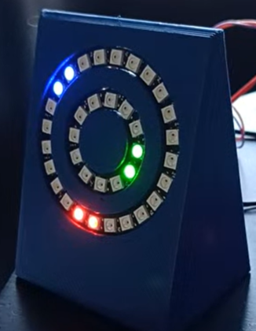

# LED Clock

A desk or wall LED clock based on the LED rings 

* Neopixel ring 12 LED - https://www.adafruit.com/product/1643
* Neopixel ring 24 LED - https://www.adafruit.com/product/1586

## Objectives

* Easy for people to modify / use
* Use an RTC to keep time even when it's off
* Use NTP to update time
* Single code to handle all 3 clock variants
* Web page to set time
* Using serial to set config
  * Change strip that each time unit is displayed on
  * Change colour of each unit
* Self hosted network for setup
* Timer functionality
  * start, pause, reset
  * programmable / controllable from buttons on device
  * config from serial, stored in EEPROM
  * Config for: Colour, number of flashes when completed, time increment for buttons(seconds, minutes, number of minutes per press)
* Programmed in Rust
  * This is stage 2

The idea is that this is could be a product that I could sell, either as a finished clock or as a kit, but it's easy enough that it can be assembled by secondary school students.

## Demos

### Basic Functionality

[Basic time movement](./docs/images/second_minute_smooth_movement.mp4)

This video shows the movements of seconds, minutes and hours and how they blend together and move around the rings.

### Time Unit Config

[Time unit config](./docs/images/time_unit_change_colour.mp4)

This video shows the colour change config of the seconds unit. It can also be re-assigned to either of the two rings

### Timer functionality

[Timer Functionality](./docs/images/timer_function.mp4)

This video shows the timer working. The timer is for 10s and then flashes to show completion.

## Docs

* [Updates](./UPDATES.md) - Updates for the "12 Projects in 12 Months" Idea
* [Notes](./docs/NOTES.md) - General notes
* [Install](./docs/INSTALL.md) - Installing and programming