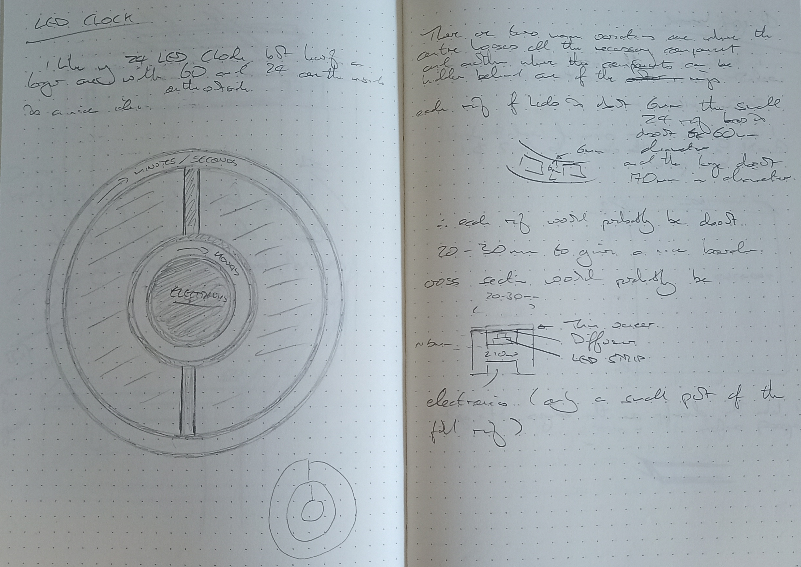

# Notes

## Software

I chose to use the Arduino IDE as it's easy for other people to use and modify, I want people to be able to make this their own.

The other options for this would have been the [ESP-IDF](https://idf.espressif.com/). I've not used it yet but I've seen some pretty cool projects using it, so it would have been an option, and as the devices I'm using aren't particularly complex it would have been easy to write the drivers necessary.

If I remember correctly there are examples using their own RTOS which would make commercial programming much easier. This would be a better option if the project needed more flexibility.

There is also the [ESP32 Rust](https://github.com/esp-rs) which is something I'll hopefully have chance to play around with for this project.

## Research

### Hardware

* It might be necessary for me to build the rings. Currently I've got a 12 and 24 but it would be good to focus on the proportion of the rings and not the number of leds. These shouldn't be too bad to do in KiCad or similar, using the standard WS2812 LEDs is sensible.

* I'm probably going to have to lay out a PCB at some point. I might be able to rely on the ESP32-Wroom-C3 boards but I'm not sure, I might want to build the RTC onto the board rather than having it as a plugin but I'll have to make space for the battery.

* Currently I'm focusing on the ESP32-C3 but if I'm going to go for the whole self hosted website / API behaviour then I might need to use an S3 for the dual core. One core can handle the LEDs and the other core is dedicated to the web page. This might need to be tested. https://thepihut.com/products/esp32-s3-zero-mini-development-board is a drop in replacement.

### Rust 

* I'm going to need to write libs for embedded rust. But it could be a good exercise to write a generic lib for these.
  * LED library - this probably exists
  * RTC library - This 'might' exist

## Behaviours

### Self hosted web page

* set LEDs into flashing mode when in self-hosted config mode

### Web config

* Want to be able to set most of the config from the web page, but I don't know how best to do this. Do I use the form to construct a JSON web API query and then process that? It does mean that I can have a web API for both the getting and setting of the config which seems like a good idea.

## Original Drawings 

